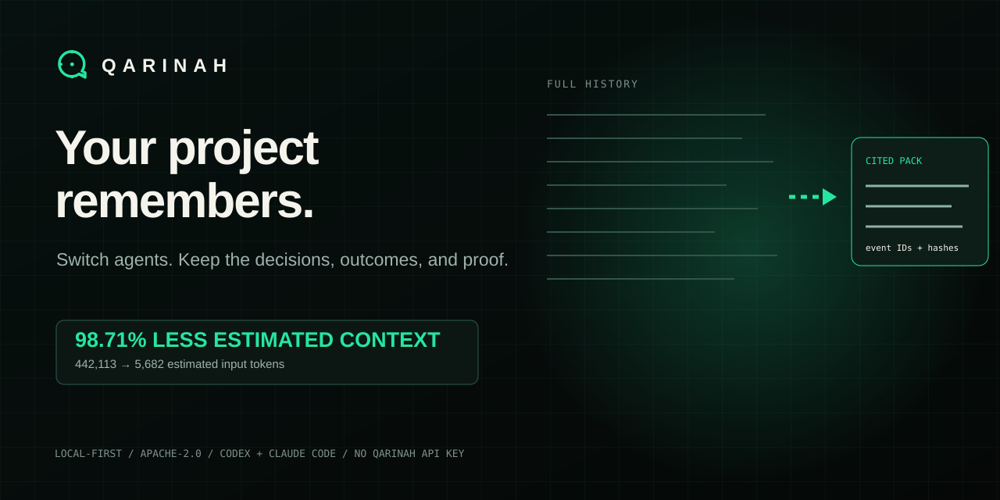
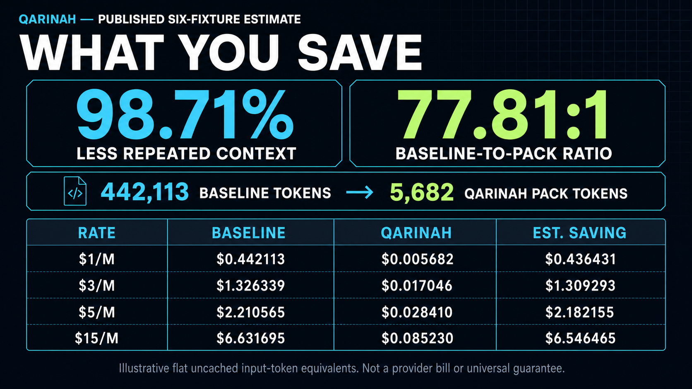

<p align="center">
  
</p>

<h1 align="center">Qarinah</h1>

<p align="center"><strong>One memory system for every Git worktree.</strong></p>

<p align="center">
  Qarinah gives every checkout its own evidence-linked memory and groups sibling worktrees into one searchable context graph. Codex, Claude Code, Cursor, Kimi, Antigravity, CLI tools, and compatible MCP clients can continue from the right branch, commit, decisions, outcomes, and files instead of replaying the whole project history.
</p>

```sh
# Initialize the exact checkout you are working in.
npx qarinah setup . --capture content --allow-query

# See every linked checkout and open all initialized worktree ledgers together.
npx qarinah worktrees
npx qarinah dashboard --serve --worktrees
```

Each worktree keeps a separate `.qarinah` ledger and consent record. Qarinah derives a shared repository identity, hashes branch and commit context into the project snapshot, and links each checkout to the files and memories it actually produced. It never replaces worktree ledgers with symlinks or a shared writable database. [Read the worktree context guide.](docs/WORKTREE-CONTEXT.md)

<p align="center">
  
</p>

## Reproducible context benchmark

| **98.7148%** | **98.75%** | **89.05%** |
| :---: | :---: | :---: |
| Six-task repeated-context reduction | Model-facing continuation capsule | Complete evidence-rich continuation pack |
| 442,113 -> 5,682 estimated tokens | 9,489 -> 119 estimated tokens | 9,489 -> 1,039 estimated tokens |

The continuation percentages use the same 42-record, two-session history but measure two different outputs: the 119-token capsule is the smallest model-facing handoff, while the 1,039-token pack preserves the complete cited audit surface. All three measurements use the reproducible portable estimator `ceil(characters / 4)`; they are not provider billing receipts. [Inspect the fixtures, exact arithmetic, and claim boundaries.](docs/BENCHMARKS.md)

### What the 77.81x ratio means

The evaluated full-history baseline contained **77.81 times as many estimated input-context tokens** as the Qarinah path: `442,113 / 5,682 = 77.81`. This supports a **77.81:1 baseline-to-pack ratio** or **more than 70x baseline-to-pack compression** for the published six-fixture estimate. It does not mean agents run 77.81 times longer or every provider bill is 77.81 times lower.

At a flat **$3 per million uncached input tokens**, the aggregate compared slice estimates **$1.326339 for full-history replay versus $0.017046 for Qarinah**, saving **$1.309293 per repeat** or **$13.092930 across ten repeats**. Use `estimated tokens / 1,000,000 x your input rate x repeats` for another rate. This arithmetic excludes provider-native tokenization, caching, output, reasoning, tools, retrieval, hosting, and fixed fees. [See the complete cost table and approved wording.](docs/PUBLIC-METRICS.md)

| Flat uncached input rate | Full-history baseline | Qarinah pack | Estimated saving |
| --- | ---: | ---: | ---: |
| $1/M tokens | $0.442113 | $0.005682 | $0.436431 |
| $3/M tokens | $1.326339 | $0.017046 | $1.309293 |
| $5/M tokens | $2.210565 | $0.028410 | $2.182155 |
| $15/M tokens | $6.631695 | $0.085230 | $6.546465 |

At the normalized $1-per-million reference rate, the same calculation is **$0.4421 versus $0.0057**. In either flat-rate example, the fixture-bound statement remains: **98.71% lower input-context cost at the same token rate.**

Scale regression: Qarinah also passed **380 / 380 file-specific exact and typo-tolerant queries** across deterministic 40-, 50-, and 100-file projects. The same run verified SQLite retrieval, graph relations, generated Markdown, conflicts, supersession, stale-projection repair, and 9 / 9 correct unsupported-query abstentions. [Inspect the multi-file method and result.](docs/BENCHMARKS.md#multi-file-project-context-and-projection-integrity-benchmark)

<p align="center"><em>Switch agents or branches. Keep the decisions, outcomes, and proof.</em></p>

<p align="center">
  Qarinah keeps one compact, cited project memory beside your code, so Codex, Claude Code, Cursor, and compatible tools can continue from verified context instead of starting from zero.
</p>

<p align="center">
  <a href="https://qarinah.io"><strong>Website</strong></a>&nbsp;&middot;&nbsp;
  <a href="https://qarinah.io/docs/features/"><strong>Features</strong></a>&nbsp;&middot;&nbsp;
  <a href="https://qarinah.io/docs/getting-started/"><strong>Install</strong></a>&nbsp;&middot;&nbsp;
  <a href="https://qarinah.io/docs/"><strong>Documentation</strong></a>&nbsp;&middot;&nbsp;
  <a href="https://qarinah.io/docs/public-metrics/"><strong>Public metrics</strong></a>&nbsp;&middot;&nbsp;
  <a href="https://qarinah.io/paper/"><strong>White paper</strong></a>&nbsp;&middot;&nbsp;
  <a href="docs/RESEARCH-BENCHMARK.md"><strong>Research benchmark</strong></a>&nbsp;&middot;&nbsp;
  <a href="https://doi.org/10.5281/zenodo.21850747"><strong>v1.4 DOI</strong></a>
</p>

<p align="center">
  <code>LOCAL-FIRST</code>&nbsp;&nbsp;
  <code>EVIDENCE-LINKED</code>&nbsp;&nbsp;
  <code>GRAPH-AWARE</code>&nbsp;&nbsp;
  <code>OKF-PORTABLE</code>&nbsp;&nbsp;
  <code>HYBRID-RETRIEVAL</code>
</p>

<p align="center">
  <strong>98.71% less estimated repeated context in the published six-task benchmark.</strong><br>
  442,113 &rarr; 5,682 estimated input-context tokens, with every required target directly covered in the top five.
  <a href="docs/BENCHMARKS.md">Inspect the method and limits.</a>
</p>

```sh
npx qarinah setup . --capture content --allow-query
```

<p align="center">
  <strong>Claude Code:</strong> <code>/qarinah release provenance</code>&nbsp;&middot;&nbsp;
  <strong>Codex:</strong> <code>$qarinah</code>&nbsp;&middot;&nbsp;
  <strong>Any host:</strong> <code>npx qarinah query "release provenance"</code>
</p>

<p align="center">
  Run the setup command once from a repository. It installs project-local integrations and consent-gated MCP retrieval for that exact workspace. Qarinah works independently; connect Maqam only when a workflow also needs policy or human approval.
</p>

---

## What Qarinah remembers for you

| Qarinah keeps | What a new coding-agent session gets |
| --- | --- |
| Your requests and visible agent outcomes | A short explanation of what was asked and what was completed |
| Tool results, decisions, approvals, and summaries | The latest verified result instead of a replay of the complete chat |
| A map of files, folders, languages, imports, and documentation links | A one-page codebase overview plus task-specific cited context |
| Event IDs, content hashes, freshness, conflicts, and superseded decisions | A way to inspect where each selected memory came from |
| Local SQLite search, a relationship graph, and readable Markdown | Fast retrieval without a hosted memory account or vector database |

```sh
# Set up memory, map the project, and connect all supported coding agents.
npx qarinah setup . --capture content --allow-query

# See the whole project in one readable page.
npx qarinah overview

# Bring an exported Codex, Claude, Kimi, or portable JSONL history with you.
npx qarinah import ./agent-exports --format auto --mode compact
```

If a native chat later disappears, Qarinah can still retrieve the permitted events and archive summaries already stored in the project-owned ledger. It cannot recover a chat that was never captured or imported. Compact archive import streams large JSONL exports, excludes hidden reasoning and encrypted reasoning blocks, and keeps one cited outcome summary per session. Read [agent archive import](docs/AGENT-ARCHIVE-IMPORT.md), [the project overview](docs/PROJECT-OVERVIEW.md), and [private/NDA-conscious operation](docs/PRIVATE-PROJECTS.md).

## Use Qarinah your way

| Setup | What Qarinah gives you |
| --- | --- |
| Personal project | One local cited memory shared by Codex, Claude Code, Cursor, Kimi, Antigravity, CLI tools, and compatible MCP clients |
| Parallel Git worktrees | Isolated ledgers per checkout, one repository group, branch-and-commit-aware snapshots, and one local graph dashboard |
| Portable review | Rebuildable SQLite, Markdown, JSON, graph, OKF, and responsive static or live-loopback dashboards for inspecting project memory |
| Team workspace | Multi-repository relationships, freshness, encrypted bundles, signed checkpoints, membership, and separate authority boundaries |
| Policy or approval add-on | Optional Maqam scopes and approval controls without making Maqam a Qarinah requirement |

Qarinah achieved 98.71% fewer estimated repeated-project-context tokens in its published software-task benchmark. That compared slice contained 436,431 fewer estimated input-context tokens, and the full-history baseline contained 77.81 times as many estimated tokens as the compiled Qarinah packs. A separate deterministic scale regression ranked the correct target first for 380 / 380 file-specific exact and typo-tolerant queries. We found no directly comparable public benchmark measuring the same project-history replay baseline. These results measure portable estimated input context and deterministic retrieval behavior, not provider billing, output tokens, latency, or universal task quality.

For the compared slice only: 98.71% lower estimated input-context cost at the same flat uncached-input token rate.

## One complete workflow

1. Begin a real task in one coding agent.
2. Record permitted decisions, changes, evidence, and tool outcomes.
3. Switch to another supported agent.
4. Ask Qarinah for the relevant handoff.
5. Receive a compact cited pack with stale, conflicting, and superseded decisions marked.
6. Finish the task without replaying the complete project history.

Qarinah is a universal context engine for software projects, built on local-first temporal memory, an authoritative event ledger, SQLite and FTS retrieval, typed relationships, freshness checks, and compact cited context packs. Read the [verified cross-agent handoff guide](docs/CROSS-AGENT-HANDOFFS.md).

## What appears in your repository

```text
.qarinah/
├── events/events.jsonl       # append-only evidence record
├── graph/graph.json          # typed decisions, sources, files, and relations
├── index/index.json          # deterministic lexical retrieval index
├── index/qarinah.db          # rebuildable SQLite WAL and FTS5 search
├── records/CONTEXT.md        # rebuildable retrieved-memory view
├── records/OVERVIEW.md       # beginner-readable project summary
├── records/DECISIONS.md      # decisions, reasons, outcomes, tools, and evidence
├── records/FLOW.md           # bounded agent and tool execution flow
├── records/CHANGES.md        # major outcomes and latest scanned changes
├── records/okf/              # portable Open Knowledge Format export
└── dashboard/index.html     # decisions, tools, flow, changes, evidence, and measured savings

.codex/skills/qarinah/        # invoke with $qarinah
.claude/skills/qarinah/       # invoke with /qarinah <task>
.cursor/                      # MCP and always-on project rule
```

The JSONL chain remains authoritative. Graph, index, Markdown, dashboard, and OKF files are rebuildable views; Qarinah does not replace evidence with an opaque model summary.

<p align="center">
  <a href="docs/WHITEPAPER.md">Technical paper</a>&nbsp;&middot;&nbsp;
  <a href="output/pdf/Qarinah-Technical-White-Paper-v1.4.pdf">Verified v1.4 PDF</a>&nbsp;&middot;&nbsp;
  <a href="https://doi.org/10.5281/zenodo.21850747">Published white paper v1.4</a>&nbsp;&middot;&nbsp;
  <a href="https://doi.org/10.5281/zenodo.21547684">Paper series DOI</a>&nbsp;&middot;&nbsp;
  <a href="docs/ARCHITECTURE.md">Architecture</a>&nbsp;&middot;&nbsp;
  <a href="docs/DASHBOARD.md">Dashboard</a>&nbsp;&middot;&nbsp;
  <a href="docs/BENCHMARKS.md">Benchmarks</a>&nbsp;&middot;&nbsp;
  <a href="docs/RESEARCH-BENCHMARK.md">Research protocol</a>&nbsp;&middot;&nbsp;
  <a href="docs/SECURITY.md">Security</a>&nbsp;&middot;&nbsp;
  <a href="docs/ECOSYSTEM-LAUNCH.md">Launch plan</a>
</p>

<p align="center">
  <strong>What if your coding agents could send 98.71% less repeated project context?</strong><br>
  442,113 estimated input-context tokens became 5,682 - 98.71% less repeated context and 77.81:1 context compression, with every required target directly covered in the top five.
</p>

<p align="center"><em>Nearly 99% less repeated context. Every selected memory points back to its source.</em></p>

> Successfully verified across React editing, database migration, TypeScript refactoring, web research, production debugging, and release preparation. The evaluated tasks sent 436,431 fewer estimated input-context tokens. At a flat $3 per million uncached input tokens, that aggregate compared context slice moves from $1.326339 to $0.017046, saving $1.309293 each time the complete slice would otherwise be sent. The percentage is independent of the chosen flat unit price; the portable token estimate excludes provider-native tokenization, output, tools, caching, retrieval, hosting, and fixed provider charges. See the [machine-readable public metrics](https://qarinah.io/metrics.json) and [methodology](docs/BENCHMARKS.md).

## Install and compile the first cited pack

```sh
npm install --save-dev qarinah
npx qarinah init .
npx qarinah record \
  --kind decision \
  --title "Keep releases provenance-bound" \
  --body "Publish only the reviewed artifact from the reviewed commit."
npx qarinah build
npx qarinah query "release provenance" \
  --minimum-coverage direct \
  --max-tokens 1500 \
  --format markdown
```

Start with the [feature map](docs/FEATURES.md) and [five-minute installation guide](docs/GETTING-STARTED.md), then use [host compatibility](docs/HOST-COMPATIBILITY.md), the [project overview](docs/PROJECT-OVERVIEW.md), [agent archive import](docs/AGENT-ARCHIVE-IMPORT.md), [external archive backup](docs/AGENT-ARCHIVE-BACKUP.md), [private-project guide](docs/PRIVATE-PROJECTS.md), [cross-agent handoff guide](docs/CROSS-AGENT-HANDOFFS.md), [dashboard guide](docs/DASHBOARD.md), [team-memory guide](docs/TEAM-MEMORY.md), [CLI reference](docs/CLI-REFERENCE.md), [JavaScript API reference](docs/API-REFERENCE.md), [MCP guide](docs/MCP-GUIDE.md), [task recipes](docs/RECIPES.md), or [troubleshooting guide](docs/TROUBLESHOOTING.md).

Your project already contains the decisions and evidence behind its changes. Qarinah lets the next agent query that record and receive a bounded, cited pack selected for the current task. The same local memory can support Codex, Claude Code, CLI workflows, and compatible MCP clients instead of locking project context to one editor.

Qarinah is a local memory and retrieval stack for coding agents. It turns captured agent activity, project structure, and explicitly committed decisions into durable project memory for Codex, Claude Code, CLIs, IDEs, and compatible MCP clients. It preserves evidence in a typed graph and deterministic Markdown and JSON views, then compiles a bounded cited pack selected for the current query instead of making an opaque summary or a full transcript the source of truth.

## Why Qarinah

Agent memory usually fails in one of two ways: the next model receives too much history, or it receives a compressed story with no way to verify the source. Qarinah keeps the source record and the compact context separate.

<table>
  <tr>
    <td width="50%"><strong>Evidence-linked</strong><br>Every selected item cites its event ID and content hash. Conflicts, supersession, authority, retention, and time remain explicit.</td>
    <td width="50%"><strong>Budgeted</strong><br>Coverage-aware retrieval compiles a bounded pack instead of replaying the complete project history.</td>
  </tr>
  <tr>
    <td width="50%"><strong>Rebuildable</strong><br>The JSONL chain is authoritative. Graph, index, Markdown, project structure, and OKF are deterministic derived views.</td>
    <td width="50%"><strong>Inspectable graph</strong><br>Search and move through memories, files, concepts, decisions, and source hashes in the local dashboard or query them from the CLI and API.</td>
  </tr>
</table>

Metadata-only capture is the default. Content capture requires explicit workspace consent. Hidden reasoning, private transcripts, credentials, and browser session state remain outside the product boundary.

## One memory stack, five readable layers

1. **Record:** each captured request, decision, result, source, or summary enters the project-owned JSONL ledger with its own identity and a hash linked to the previous record.
2. **Index:** Qarinah rebuilds a local SQLite/FTS5 read model for fast text search. No hosted database is required.
3. **Connect:** the typed graph links memories to files, directories, concepts, sources, conflicts, and superseded decisions. Project scans contribute paths and hashes, not a second source of truth.
4. **Compress:** hybrid retrieval combines lexical relevance, one-hop graph evidence, and structural importance to produce a small cited pack for the task.
5. **Expand:** every selected item keeps its event ID and content hash, so a developer can inspect the full retained record, its neighbors, and the readable Markdown view when more detail is needed.

```sh
# Search memory and code relationships from the terminal.
npx qarinah map "release approval module" --type memory,file,concept

# Open the local circular graph, drag crowded nodes, and inspect source hashes.
npx qarinah dashboard --serve
```

## Compile memory before the model request

When a host or orchestrator queries Qarinah before constructing a model request, Qarinah compiles the retained project history into a bounded cited pack first. That same pack can be supplied to a small local model, a large-context model, or a high-reasoning Codex or Claude session. The compiler itself does not need an embedding API, a hosted memory service, or a Qarinah API key.

Packs are requested explicitly. Hosts can call the CLI or JavaScript API, enable Qarinah's zero-write MCP `context.query` tool with a permit bound to the exact workspace and current consent-policy hash, or optionally route a query through Maqam when policy or approval is useful. Without that permit, the built-in MCP server exposes diagnostics only.

## What it records

Qarinah records every captured lifecycle event delivered by a supported host adapter and every decision that a user or connected workflow explicitly commits. It does not claim to infer every cognitive decision automatically.

Supported event classes include prompts, tool requests, tool completions, approvals, artifacts, sources, claims, decisions, summaries, compactions, subagents, completed turns, and failed turns. Relations connect sessions, turns, tool calls, sources, approvals, conflicts, supersession, derived evidence, and produced project structure.

## Architecture

<p align="center">
  
</p>

The project graph covers directories, files, content hashes, JavaScript and TypeScript module references, Markdown links, exact source spans, additions, changes, renames, and deletions. See the [architecture guide](docs/ARCHITECTURE.md) or the [editable diagram source](docs/architecture.mmd).

## Technology

Qarinah is intentionally small, local, and inspectable:

| Layer | Technology |
| --- | --- |
| Runtime | Modern Node.js ESM on maintained Node 22, 24, and 26 releases |
| Durable memory | Append-only canonical JSONL events, SHA-256 content and chain hashes, temporal validity, repository identity, machine-local checkpoints, and renewable write locks |
| Fast local reads | Disposable SQLite WAL database with FTS5, schema migrations, typed tables, and a complete ledger-derived rebuild path |
| Project graph | Typed event, evidence, repository, dependency, module, Markdown-link, citation, conflict, supersession, file, rename, change, and deletion edges |
| Linked project memory | A bounded temporal view that joins admitted memories to the latest explicit repository scan, computes deterministic repository importance, and exposes the exact local, linked, and structural basis for every ranked result |
| Retrieval | SQLite FTS5, BM25, typo tolerance, graph traversal, reciprocal-rank fusion, time and freshness filters, host-owned authority scopes, repository isolation, conflict/supersession handling, and diversity |
| Context compiler | Complete-output character and token budgets, explicit output headroom, evidence-coverage gates, deterministic citations, and reproducible manifests |
| Human-readable views | Rebuildable Markdown, JSON, graph, index, and Google OKF 0.1 Draft exports |
| Agent integration | One-command Codex, Claude Code, Cursor, Kimi, and Antigravity setup; reviewed Codex/Claude lifecycle hooks; strict JSON stdin; typed JavaScript API; and consent-gated stdio MCP retrieval |
| Optional adapters | Local or customer-provided embeddings, query expansion, and rerankers may reorder admitted cited evidence without replacing ledger authority |
| Infrastructure | No required vector database, hosted backend, embedding bill, model provider, daemon, analytics endpoint, or Qarinah API key |

## Install

Qarinah requires a maintained Node.js 22, 24, or 26 release.

```sh
npm install --save-dev qarinah
npx qarinah setup . --capture content --allow-query
```

The package is designed for local use. It does not require a hosted Qarinah account, embedding service, or Qarinah API key.

## Initialize once, remember across supported sessions

`npx qarinah setup . --capture content --allow-query` is the one-time, explicit opt-in for that exact workspace and capture policy. It initializes SQLite and the other derived views, records a bounded map of the codebase, installs project-local integrations, configures consent-gated MCP retrieval, and runs a health check. Codex and Claude Code have reviewed lifecycle capture adapters. Cursor, Kimi, and Antigravity use their documented project-level MCP surfaces; their host history is imported only from an explicit supported export. Qarinah can then compile a small cited pack on demand, so a new task in that folder does not need the whole retained history replayed into its prompt.

Qarinah is project memory, not an always-running agent or application supervisor. It does not keep an agent running, prevent provider-side context compaction, or capture host activity the host does not expose. When a host compacts its own conversation, Qarinah preserves only the permitted evidence it actually received and makes it available to an explicit CLI/API query or a workspace-authorized, bounded MCP query.

Existing visible Codex, Claude, Kimi stream-json, or portable agent exports can be streamed in later with `qarinah import`. The safe compact mode is designed for large histories: it records cited per-session summaries and source digests rather than copying every raw byte into Qarinah. Full visible-history import is available only in a content-authorized workspace and remains bounded by the configured ledger limits.

## Team-memory platform

The public package now includes:

- consent-gated, zero-write MCP `context.query` with exact workspace and policy-hash authorization;
- one-command Codex, Claude Code, Cursor, Kimi, and Antigravity setup;
- a local visual dashboard for decisions, supersession, conflicts, citations, activity, savings, and affected files;
- freshness checks for changed, missing, or unsafe cited files;
- temporal validity, point-in-time queries, stale-citation detection, conflicts, and supersessions;
- a rebuildable SQLite WAL/FTS5 read model derived from the JSONL authority;
- Maqam-owned temporary memory attachments that agents cannot self-grant;
- task packs for debugging, code review, feature work, database migration, incident response, release preparation, and security review;
- multi-repository context with typed cross-repository relationships and separate cited authority;
- optional semantic reranking that cannot introduce unadmitted sources;
- an encrypted team-sync protocol with roles, GitHub binding, and signed checkpoints;
- evaluation for recall, citation accuracy, stale rejection, conflict and supersession correctness, repository isolation, unauthorized-disclosure rejection, supplied tokens, net task cost, latency, completion, and repeated mistakes; and
- causal receipts connecting Cockroach evidence, Qarinah memory, Maqam policy, execution, and observed results.

See [Shared and verifiable team memory](docs/TEAM-MEMORY.md) for commands, APIs, and security boundaries.

## Inspect project memory in the local dashboard

<p align="center">
  
</p>

This is a real generated snapshot from an initialized Qarinah workspace. The current decision explains why the next stable promotion is held, the superseded cards preserve the earlier record, and every displayed count is derived from the local ledger and project scan.

Generate a read-only HTML snapshot from the verified local ledger:

```sh
npx qarinah build
npx qarinah scan
npx qarinah dashboard
npx qarinah export okf --output .qarinah/records/qarinah-project.okf.json
```

Open `.qarinah/dashboard/index.html` in a browser. The dashboard shows:

- current and explicitly superseded decisions, including recorded reasons, outcomes, alternatives, linked tools, and evidence hashes;
- the bounded execution flow and the tools requested or completed in each retained turn;
- major recorded outcomes and latest scanned file changes;
- explicit conflicts requiring attention;
- source-linked events and their evidence identifiers;
- the latest 100 permitted activity events;
- paths, languages, and content hashes from the latest project scan; and
- an automatic, evidence-labeled ledger/import-to-pack context estimate, with optional explicit snapshot inputs; plus
- current retained project-memory bytes, measured imported source bytes when available, and the task-pack manifest and estimated size.

The generated dashboard adapts to phone, tablet, and desktop widths. Long decision, activity, flow, citation, tool, change, conflict, and file collections paginate independently; wide evidence tables scroll inside their own panel instead of widening the page.

For a live view that rereads actual retained local activity whenever the ledger changes, serve it on loopback:

```sh
npx qarinah dashboard --serve

# Add other initialized projects explicitly. Qarinah never scans your disk for them.
npx qarinah dashboard --serve --project ../frontend --project ../api
```

The project switcher identifies each authorized workspace by project directory, Qarinah workspace ID, and any repository identities actually retained on events. The server binds only to `127.0.0.1`, rejects foreign Host headers, sends no analytics, and does not merge project authority boundaries.

To include a context comparison for a real run, supply both estimates:

```sh
npx qarinah dashboard --baseline-tokens 12000 --delivered-tokens 1500
```

Those numbers are supplied by the caller; the dashboard does not infer provider billing or manufacture a savings result. The static file is a rebuildable snapshot with no remote scripts or analytics. Live mode rereads the same verified project-owned ledger on localhost; it does not invent events. The hash-chained JSONL ledger remains authoritative, and the separate `qarinah freshness` command checks whether cited files have changed.

Measure the three quantities directly:

```sh
npx qarinah footprint "release decisions and failed checks"
```

Qarinah does not claim that a large source archive becomes a lossless few-kilobyte file. It preserves authorized project memory locally and sends a small task-relevant cited pack to the agent. Read [memory-footprint measurement](docs/MEMORY-FOOTPRINT.md) for the exact distinction and [the Azure evaluation](docs/AZURE-EVALUATION.md) before considering a shared remote index.

`qarinah setup` creates the empty SQLite database, relationship graph, readable overview, decision/flow/change records, and dashboard immediately. Later records and scans rebuild the derived views from the verified ledger.

JavaScript callers can pass an `AbortSignal` to `appendEvent`, `readEvents`, and `rebuildDerivedState`. A cancelled writer-lock wait makes no durable change; once an append has crossed its irreversible log boundary, Qarinah finishes the matching identity and checkpoint metadata so the ledger remains recoverable.

To preserve an exported Codex/Claude/portable JSONL archive on an external drive during setup, add explicit `--backup-source` and `--backup-destination` paths. Qarinah streams only JSONL/NDJSON files, enforces limits, rejects linked paths, verifies SHA-256 digests, writes an external manifest, and records a compact project receipt. See [External agent-archive backup](docs/AGENT-ARCHIVE-BACKUP.md).

Read the complete [local memory dashboard guide](docs/DASHBOARD.md) for every panel, data lineage, CLI and JavaScript APIs, population recipes, privacy guidance, and troubleshooting. Release maintainers should also use the [0.5.0 readiness checklist](docs/RELEASE-READINESS-0.5.md).

## Five-minute proof

```sh
# Opt in. Metadata-only capture is the default.
npx qarinah init .

# Commit one durable decision.
npx qarinah record \
  --kind decision \
  --title "Keep releases provenance-bound" \
  --body "Publish only the reviewed artifact from the reviewed commit."

# Record the bounded project structure and rebuild derived views.
npx qarinah scan
npx qarinah build

# Retrieve only direct evidence and emit cited Markdown.
npx qarinah query "release provenance" \
  --minimum-coverage direct \
  --format markdown

# Verify policy, event hashes, checkpoint, and derived state.
npx qarinah doctor
```

For agent callers, use the strict JSON stdin interfaces so untrusted text is never interpolated into a shell command:

```sh
printf '%s' '{"query":"release provenance","format":"json","minimumCoverage":"direct","maxChars":8000}' \
  | npx qarinah query --stdin-json
```

## Durable files

```text
.qarinah/
  config.json          portable workspace identity and requested policy
  events/events.jsonl  authoritative append-only event chain
  graph/graph.json     event and project nodes with typed edges
  index/index.json     disposable deterministic retrieval index
  records/CONTEXT.md   human-readable current record
  records/okf/         reproducible Markdown interoperability bundle
  index/event-ids/     checkpoint-authenticated idempotency projection
```

Delete any derived graph, index, or Markdown view and run `qarinah build` to reproduce it from the verified event chain.

## Portable by design

Qarinah can export a verified workspace record as a deterministic [Google Open Knowledge Format 0.1 Draft](https://github.com/GoogleCloudPlatform/knowledge-catalog/blob/main/okf/SPEC.md) bundle:

```sh
npx qarinah export okf
```

The export is reviewable Markdown with a root index, a chronological log, one concept file per event, typed relations, citations, content hashes, and chain hashes. It can be diffed in Git, inspected without Qarinah, or passed to another system that understands OKF Markdown. The append-only JSONL event chain remains authoritative; OKF is a deterministic, replaceable interchange view rather than a second database or retrieval engine. See [interoperability](docs/INTEROPERABILITY.md#google-open-knowledge-format-derived-interchange).

## Retrieval

Qarinah's dependency-free local retriever combines BM25, character-trigram typo tolerance, one-hop graph evidence, reciprocal-rank fusion, deterministic diversity, explicit supersession, conflict visibility, retention, time, and scoped authority.

Context-pack v2 adds evidence coverage:

```json
{
  "coverage": {
    "method": "query-term-overlap-v1",
    "status": "direct",
    "queryTermCount": 2,
    "bestExactTermCount": 2,
    "bestExactTermRatio": 1,
    "directCandidateCount": 3
  }
}
```

`minimumCoverage: "partial"` rejects no-evidence packs. `minimumCoverage: "direct"` accepts only a record containing every normalized query term. Coverage is a deterministic retrieval diagnostic, not a claim that a model answer is correct.

## Codex and Claude Code

The repository includes generated, dependency-free plugin runtimes for Codex and Claude Code. Both provide:

- allowlisted lifecycle hooks;
- a Qarinah context skill;
- zero-write `context_status` and `context_doctor` MCP tools plus optional consent-gated `context.query`, all with exact workspace selection;
- explicit CLI querying for user-directed local workflows.

Codex and Claude Code plugin caches are immutable copies. Reinstall the reviewed plugin and start a new task after an upgrade. Claude requires an explicitly selected absolute Node 22, 24, or 26 executable. Codex still inherits the host's reviewed Node `PATH` boundary because its current plugin schema does not expose an equivalent file setting. See [host integrations](docs/HOST-INTEGRATIONS.md).

Ambient MCP context disclosure remains disabled. `context.query` appears only after explicit setup with `--allow-query`; its permit is bound to the exact workspace policy hash and strict item and character limits. Durable MCP writes remain unavailable.

The repository also runs `npm run mcp:smoke` against the exact bundled Codex and Claude runtimes. The smoke test starts each stdio server from its packaged manifest, exercises Codex without MCP roots using an exact trusted workspace selector, exercises Claude with negotiated roots, lists the two annotated tools, calls both tools against a temporary trusted ledger, and verifies clean shutdown without stderr output.

### Install once, initialize each project

Install the reviewed `v0.1.9` plugin once in each host after that release is published:

```sh
# Codex: personal installation, available to opted-in projects.
codex plugin marketplace add AjnasNB/qarinah --ref v0.1.9
codex plugin add qarinah@qarinah

# Claude Code: personal installation across projects.
claude plugin marketplace add AjnasNB/qarinah@v0.1.9 --scope user
claude plugin install qarinah@qarinah --scope user
```

Then opt in from the root of each project that should retain context:

```sh
npx -y qarinah@latest init . --capture content
npx -y qarinah@latest scan
npx -y qarinah@latest doctor
```

Use `--capture metadata` when event bodies should not be retained. Content mode records only bounded, redacted fields exposed by supported hooks; it does not parse hidden transcripts or reasoning. At the start of a later task, ask the installed Qarinah context skill for direct evidence related to the task, or run a bounded query:

```sh
npx -y qarinah@latest query "checkout dialog focus trap" \
  --minimum-coverage direct \
  --max-tokens 1500 \
  --reserve-tokens 200 \
  --format markdown
```

The returned pack selects complete cited records from the verified event chain. It is not a model-written rolling summary. Plugin installation is host-wide; capture permission and retained context remain project-specific. See [host integrations](docs/HOST-INTEGRATIONS.md) for current private-clone testing, Claude project/local scopes, upgrades, and interpreter trust.

## Optional ecosystem connections

- **Qarinah remembers** decisions, evidence, provenance, outcomes, and code relationships.
- **Cockroach Crawler gathers** public web records for research and extraction workflows.
- **Cockroach Browser emits** cited browser-outcome metadata from interactive sessions.
- **Maqam optionally adds** policy and approval to selected registered reads or writes.
- **ProductLoop can orchestrate** workflows across independently installed tools.
- **ProductLoop Workbench can present** durable local runs, approval records, evidence, and cited Qarinah event references to one operator.

These are composable packages, not one silently merged runtime. Qarinah also works without the other packages. Workbench stores Qarinah event IDs and hashes as references; it does not gain context-disclosure or append authority. Qarinah's Cockroach Browser adapter is a passive, metadata-only sink: it cannot launch a browser, inspect a session, approve an action, or grant origin access. See the [interoperability contract](docs/INTEROPERABILITY.md#cockroach-browser-cited-metadata-outcomes).

## Security model

- no capture outside an explicitly initialized and machine-trusted workspace;
- revocation state stored outside the repository;
- metadata-only capture by default;
- bounded recursive redaction and strict event, log, context, path, and scan limits;
- renewable append locks, linked-path rejection, hash chaining, rollback checkpoints, and deterministic rebuilds;
- context treated as untrusted data, never executable instructions;
- explicit no-evidence and fail-closed retrieval modes;
- no transcript parsing or hidden chain-of-thought capture;
- no model provider, database, daemon, analytics endpoint, or Qarinah API key required.

Content-mode redaction cannot prove that arbitrary tool output contains no secret. Keep metadata mode unless retained content has already been reviewed. See [security](docs/SECURITY.md), [privacy](PRIVACY.md), and [threat boundaries](docs/ARCHITECTURE.md).

## Commands

| Command | Purpose |
| --- | --- |
| `qarinah init [path]` | Opt a workspace into metadata or content capture |
| `qarinah policy` / `qarinah trust` | Review and approve the exact machine-local capture policy |
| `qarinah record` | Append a validated decision, source, claim, approval, or other event |
| `qarinah hook codex\|claude` | Normalize one supported host lifecycle event from stdin |
| `qarinah scan` | Record a bounded project structure snapshot |
| `qarinah build` | Verify and rebuild graph, index, and Markdown |
| `qarinah map` | Search admitted memory and the repository map with temporal, repository, scope, and node-type filters |
| `qarinah query` | Compile a coverage-aware, cited, budgeted context pack |
| `qarinah export okf` | Build a deterministic Markdown interoperability bundle |
| `qarinah doctor` / `qarinah status` | Verify integrity or inspect current state |
| `qarinah untrust` | Revoke local capture permission without deleting project files |

See [Linked project memory](docs/LINKED-PROJECT-MEMORY.md) for the ranking formula, access boundary, graph coverage limits, JavaScript API, and live dashboard endpoints.

## Benchmarks

Run:

```sh
npm run evaluate:software-tasks
npm run evaluate:long-document
npm run evaluate:context
npm run evaluate:continuation
npm run benchmark
npm run prepare:research
npm run evaluate:research-retrieval
```

| Software task | Full history + current sources | Qarinah + same sources | Reduction |
| --- | ---: | ---: | ---: |
| React accessibility edit | 73,765 estimated tokens | 1,025 estimated tokens | 98.61% |
| Database schema migration | 73,703 | 968 | 98.69% |
| TypeScript codebase refactor | 73,628 | 895 | 98.78% |
| Web research to implementation | 73,693 | 963 | 98.69% |
| Production regression debugging | 73,697 | 954 | 98.71% |
| Governed release preparation | 73,627 | 877 | 98.81% |
| **Weighted total** | **442,113** | **5,682** | **98.71%** |

The software-task evaluator keeps the required current source snippets on both sides and replaces only accumulated-history replay. Its estimates use `ceil(characters / 4)`; they are not provider usage receipts. The release also successfully verifies exact retrieval, typo tolerance, graph evidence, conflict visibility, and supersession. See [BENCHMARKS.md](docs/BENCHMARKS.md) for the committed sources, machine-readable results, commands, and arithmetic.

The long-document evaluator adds a fixed 600-token ceiling over a deterministic 34,751-estimated-token handbook fixture. All 16 exact and typo-tolerant lookups return the cited answer-bearing section at rank 1, with an average pack of 534 estimated tokens and a worst-case estimated reduction of 98.4%; four unsupported questions fail closed when the caller requires direct evidence coverage. This is a segmented synthetic retrieval fixture - not whole-book summarization, native PDF ingestion, or provider-billed token usage.

The [cross-session continuation benchmark](docs/CROSS-SESSION-CONTINUATION-BENCHMARK.md) adds a 42-record two-session fixture for context summarization, evidence links, and fresh-session retrieval. Its complete 1,039-token cited audit pack is 89.05% smaller than the 9,489-token full-ledger estimate and preserves all three summary source IDs and hashes. A separate 119-token model-facing capsule points to that verified pack and the selected summary event, reaching 98.75% reduction on the same unchanged fixture without removing the audit trail. The read also leaves deliberately stale derived state unchanged. A separate provider-backed Codex-to-Codex smoke uses distinct ephemeral sessions with native resume disabled, requires the second session to query Qarinah and cite its evidence, and verifies the resulting patch with tests. The provider smoke is product evidence, not a controlled research result.

The separate [real-repository research track](docs/RESEARCH-BENCHMARK.md) pins 300 public SWE-bench Lite tasks into a chronological 60-task warm-up / 240-task development split. Frozen exploratory v0.1 found that BM25 beat the original balanced Qarinah ranker. Admission-first v2 preserves admitted BM25 ranking while retaining repository, temporal, retention, disclosure, conflict, supersession, provenance, and budget controls; online MRR improves from 0.601 to 0.696 against balanced-v1 under the graded structural development oracle. Graph ranking adds no measured value here. Historical v0.3 calibrated a conservative decision over frozen v0.2 scores. The immutable [production-bound v0.4 recomputation](docs/RESEARCH-DEVELOPMENT-RESULTS-v0.4.md) uses `evidence-sufficiency-v2`: it observed 10/10 static and 15/15 online direct accepts as structural-oracle positives, with 0/49 and 0/31 false accepts. Exact 95% false-acceptance upper bounds remain 7.25% and 11.22%, and coverage remains deliberately low at 4.17%-6.25%.

A separately authorized [current-product source-bound v0.5 differential reproduction](bench/results/research-retrieval-development-v0.5.json) exactly matched the complete immutable v0.4 `expected` projection on the same inspected development corpus: 3,110,007 canonical bytes with SHA-256 `12f00c2e831e56b26c7eeff13d8b6aed0fee22760d40f5a46a1cb579870b3d0c`. The result is commit `4dba5b667a8c3a135c4574fcfefe12502f792a32`, tag `research-retrieval-development-v0.5-result`, and artifact SHA-256 `38a753e82e1f9e8e0337dca3f764c941a4cf78748c09a7b8341ae08cf7494a94`. This is development-only, non-confirmatory reproduction evidence; it made zero provider calls and does not measure provider tokens, coding-agent task success, latency, or cost. The research package also freezes 387 positive tasks, 20 abstention controls, a contamination audit, and a pre-outcome 40-pair power check.

## License and ownership

Qarinah source code is available under [Apache License 2.0](LICENSE). Apache-2.0 permits commercial use, modification, and redistribution under its terms. Copyright, a contributor sign-off policy, product execution, and a distinct brand can preserve project stewardship, but an open-source license cannot prohibit compliant commercialization.

See [contributing](CONTRIBUTING.md), [governance](GOVERNANCE.md), [third-party notices](THIRD_PARTY_NOTICES.md), [brand use](TRADEMARKS.md), [support](SUPPORT.md), and [launch gates](docs/LAUNCH.md).
