<p align="center">
  
</p>

<h1 align="center">Qarinah</h1>

<p align="center"><em>Switch coding agents without starting over.</em></p>
<p align="center"><strong>The evidence-linked cross-agent context engine for software projects.</strong></p>

<p align="center">
  Qarinah lets Codex, Claude Code, Cursor, and other coding agents continue the same project using a shared, cited record of decisions, outcomes, code relationships, and current evidence.
</p>

<p align="center">
  <a href="https://qarinah.io"><strong>Website</strong></a>&nbsp;&middot;&nbsp;
  <a href="https://qarinah.io/docs/"><strong>Documentation</strong></a>&nbsp;&middot;&nbsp;
  <a href="https://qarinah.io/paper/"><strong>White paper</strong></a>&nbsp;&middot;&nbsp;
  <a href="docs/RESEARCH-BENCHMARK.md"><strong>Research benchmark</strong></a>&nbsp;&middot;&nbsp;
  <a href="https://doi.org/10.5281/zenodo.21547685"><strong>DOI</strong></a>
</p>

<p align="center">
  <code>LOCAL-FIRST</code>&nbsp;&nbsp;
  <code>EVIDENCE-LINKED</code>&nbsp;&nbsp;
  <code>GRAPH-AWARE</code>&nbsp;&nbsp;
  <code>OKF-PORTABLE</code>&nbsp;&nbsp;
  <code>GOVERNANCE-READY</code>
</p>

<p align="center">
  <strong>Verified handoffs between coding agents.</strong>
</p>

```sh
npx qarinah setup . --codex --claude --cursor --capture content --allow-query
```

<p align="center">
  <strong>Claude Code:</strong> <code>/qarinah release provenance</code>&nbsp;&middot;&nbsp;
  <strong>Codex:</strong> <code>$qarinah</code>&nbsp;&middot;&nbsp;
  <strong>Any host:</strong> <code>npx qarinah query "release provenance"</code>
</p>

<p align="center">
  Run the setup command once from a repository. It installs project-local integrations and consent-gated MCP retrieval for that exact workspace. Qarinah works as an independent local tool; Maqam is an optional governance integration for higher-authority workflows.
</p>

<p align="center">
  <strong>98.71% fewer estimated repeated-project-context tokens - 77.81:1 compression.</strong><br>
  442,113 &rarr; 5,682 estimated input tokens.
  <a href="docs/BENCHMARKS.md">Reproduce the published benchmark.</a>
</p>

---

## Use Qarinah your way

| Setup | What Qarinah gives you |
| --- | --- |
| Personal project | One local cited memory shared by Codex, Claude Code, Cursor, CLI tools, and compatible MCP clients |
| Portable review | Rebuildable Markdown, JSON, graph, OKF, and a local static dashboard for inspecting project memory on desktop or mobile |
| Team workspace | Multi-repository relationships, freshness, encrypted bundles, signed checkpoints, membership, and separate authority boundaries |
| Governed workflow | Optional Maqam memory scopes and disclosure controls without making Maqam a requirement |

Qarinah achieved 98.71% fewer estimated repeated-project-context tokens in its published software-task benchmark. We found no directly comparable public benchmark measuring the same project-history replay baseline. The result measures estimated input context, not provider billing, output tokens, latency, or universal task quality.

98.71% lower input-context cost at the same token rate.

## One complete workflow

1. Begin a real task in one coding agent.
2. Record permitted decisions, changes, evidence, and tool outcomes.
3. Switch to another supported agent.
4. Ask Qarinah for the relevant handoff.
5. Receive a compact cited pack with stale, conflicting, and superseded decisions marked.
6. Finish the task without replaying the complete project history.

Qarinah is a universal context engine for software projects, built on local-first temporal memory, an authoritative event ledger, SQLite and FTS retrieval, typed relationships, freshness checks, and compact cited context packs. Read the [verified cross-agent handoff guide](docs/CROSS-AGENT-HANDOFFS.md).

## What appears in your repository

```text
.qarinah/
├── events/events.jsonl       # append-only evidence record
├── graph/graph.json          # typed decisions, sources, files, and relations
├── index/index.json          # deterministic lexical retrieval index
├── CONTEXT.md                # rebuildable human-readable view
├── okf/                      # portable Open Knowledge Format export
└── dashboard/index.html     # decisions, conflicts, citations, activity, files, and measured savings

.codex/skills/qarinah/        # invoke with $qarinah
.claude/skills/qarinah/       # invoke with /qarinah <task>
.cursor/                      # MCP and always-on project rule
```

The JSONL chain remains authoritative. Graph, index, Markdown, dashboard, and OKF files are rebuildable views; Qarinah does not replace evidence with an opaque model summary.

<p align="center">
  <a href="docs/WHITEPAPER.md">Technical paper</a>&nbsp;&middot;&nbsp;
  <a href="https://github.com/AjnasNB/qarinah/blob/main/output/pdf/Qarinah-Technical-White-Paper-v1.0.pdf">Publication PDF</a>&nbsp;&middot;&nbsp;
  <a href="https://doi.org/10.5281/zenodo.21547685">Zenodo record</a>&nbsp;&middot;&nbsp;
  <a href="docs/ARCHITECTURE.md">Architecture</a>&nbsp;&middot;&nbsp;
  <a href="docs/DASHBOARD.md">Dashboard</a>&nbsp;&middot;&nbsp;
  <a href="docs/BENCHMARKS.md">Benchmarks</a>&nbsp;&middot;&nbsp;
  <a href="docs/RESEARCH-BENCHMARK.md">Research protocol</a>&nbsp;&middot;&nbsp;
  <a href="docs/SECURITY.md">Security</a>&nbsp;&middot;&nbsp;
  <a href="docs/ECOSYSTEM-LAUNCH.md">Launch plan</a>
</p>

<p align="center">
  <strong>What if your coding agents could send 98.71% less repeated project context?</strong><br>
  442,113 estimated input-context tokens became 5,682 - 98.71% less repeated context and 77.81:1 context compression, with every required target directly covered in the top five.
</p>

<p align="center"><em>Nearly 99% less repeated context. Every selected memory points back to its source.</em></p>

> Successfully verified across React editing, database migration, TypeScript refactoring, web research, production debugging, and governed release work. The evaluated tasks sent 436,431 fewer estimated input-context tokens. At a flat $1 per million uncached input tokens, that compared context slice moves from $0.4421 to $0.0057 - 98.71% less input-context cost under the same unit price. The percentage is independent of the chosen flat unit price; the portable token estimate excludes output, tools, caching, and fixed provider charges. See the [machine-readable result](bench/results/software-task-context-0.1.0.json) and [methodology](docs/BENCHMARKS.md).

## Install and compile the first cited pack

```sh
npm install --save-dev qarinah
npx qarinah init .
npx qarinah record \
  --kind decision \
  --title "Keep releases provenance-bound" \
  --body "Publish only the reviewed artifact from the reviewed commit."
npx qarinah build
npx qarinah query "release provenance" \
  --minimum-coverage direct \
  --max-tokens 1500 \
  --format markdown
```

Start with the [five-minute guide](docs/GETTING-STARTED.md), then use the [cross-agent handoff guide](docs/CROSS-AGENT-HANDOFFS.md), [dashboard guide](docs/DASHBOARD.md), [team-memory guide](docs/TEAM-MEMORY.md), [CLI reference](docs/CLI-REFERENCE.md), [JavaScript API reference](docs/API-REFERENCE.md), [MCP guide](docs/MCP-GUIDE.md), [task recipes](docs/RECIPES.md), or [troubleshooting guide](docs/TROUBLESHOOTING.md).

Your project already contains the decisions and evidence behind its changes. Qarinah lets the next agent query that record and receive a bounded, cited pack selected for the current task. The same local memory can support Codex, Claude Code, CLI workflows, and compatible MCP clients instead of locking project context to one editor.

Qarinah is a local memory compiler for coding agents. It turns permitted agent activity, project structure, and explicitly committed decisions into durable project memory for Codex, Claude Code, CLIs, and governed workflows. It preserves evidence in a typed graph and deterministic Markdown and JSON views, then compiles a bounded cited pack selected for the current query instead of making an opaque summary or a full transcript the source of truth.

## Why Qarinah

Agent memory usually fails in one of two ways: the next model receives too much history, or it receives a compressed story with no way to verify the source. Qarinah keeps the source record and the compact context separate.

<table>
  <tr>
    <td width="50%"><strong>Evidence-linked</strong><br>Every selected item cites its event ID and content hash. Conflicts, supersession, authority, retention, and time remain explicit.</td>
    <td width="50%"><strong>Budgeted</strong><br>Coverage-aware retrieval compiles a bounded pack instead of replaying the complete project history.</td>
  </tr>
  <tr>
    <td width="50%"><strong>Rebuildable</strong><br>The JSONL chain is authoritative. Graph, index, Markdown, project structure, and OKF are deterministic derived views.</td>
    <td width="50%"><strong>Governance-ready</strong><br>Explicit capture policy, fail-closed coverage, consent-gated MCP retrieval, and optional Maqam disclosure controls preserve boundaries.</td>
  </tr>
</table>

Metadata-only capture is the default. Content capture requires explicit workspace consent. Hidden reasoning, private transcripts, credentials, and browser session state remain outside the product boundary.

## Compile memory before the model request

When a host or orchestrator queries Qarinah before constructing a model request, Qarinah compiles the retained project history into a bounded cited pack first. That same pack can be supplied to a small local model, a large-context model, or a high-reasoning Codex or Claude session. The compiler itself does not need an embedding API, a hosted memory service, or a Qarinah API key.

Packs are requested explicitly. Hosts can call the CLI or JavaScript API, use a separately governed Maqam capability, or enable Qarinah's zero-write MCP `context.query` tool with a permit bound to the exact workspace and current consent-policy hash. Without that permit, the built-in MCP server exposes diagnostics only.

## What it records

Qarinah records every permitted lifecycle event delivered by a supported host adapter and every decision that a user or governed workflow explicitly commits. It does not claim to infer every cognitive decision automatically.

Supported event classes include prompts, tool requests, tool completions, approvals, artifacts, sources, claims, decisions, summaries, compactions, subagents, completed turns, and failed turns. Relations connect sessions, turns, tool calls, sources, approvals, conflicts, supersession, derived evidence, and produced project structure.

## Architecture

<p align="center">
  
</p>

The project graph covers directories, files, content hashes, JavaScript and TypeScript module references, Markdown links, exact source spans, additions, changes, renames, and deletions. See the [architecture guide](docs/ARCHITECTURE.md) or the [editable diagram source](docs/architecture.mmd).

## Technology

Qarinah is intentionally small, local, and inspectable:

| Layer | Technology |
| --- | --- |
| Runtime | Modern Node.js ESM on maintained Node 22, 24, and 26 releases |
| Durable memory | Append-only canonical JSONL events, SHA-256 content and chain hashes, temporal validity, repository identity, machine-local checkpoints, and renewable write locks |
| Fast local reads | Disposable SQLite WAL database with FTS5, schema migrations, typed tables, and a complete ledger-derived rebuild path |
| Project graph | Typed event, evidence, repository, dependency, module, Markdown-link, citation, conflict, supersession, file, rename, change, and deletion edges |
| Retrieval | SQLite FTS5, BM25, typo tolerance, graph traversal, reciprocal-rank fusion, time and freshness filters, host-owned authority scopes, repository isolation, conflict/supersession handling, and diversity |
| Context compiler | Complete-output character and token budgets, explicit output headroom, evidence-coverage gates, deterministic citations, and reproducible manifests |
| Human-readable views | Rebuildable Markdown, JSON, graph, index, and Google OKF 0.1 Draft exports |
| Agent integration | One-command Codex, Claude Code, and Cursor setup; lifecycle hooks; strict JSON stdin; typed JavaScript API; and consent-gated stdio MCP retrieval |
| Optional adapters | Local or customer-provided embeddings, query expansion, and rerankers may reorder admitted cited evidence without replacing ledger authority |
| Infrastructure | No required vector database, hosted backend, embedding bill, model provider, daemon, analytics endpoint, or Qarinah API key |

## Install

Qarinah requires a maintained Node.js 22, 24, or 26 release.

```sh
npm install --save-dev qarinah
npx qarinah setup . --codex --claude --cursor --capture content --allow-query
```

The package is designed for local use. It does not require a hosted Qarinah account, embedding service, or Qarinah API key.

## Initialize once, remember across supported sessions

`npx qarinah setup . --codex --claude --cursor --capture content --allow-query` is the one-time, explicit opt-in for that exact workspace and capture policy. It initializes the project, installs project-local integrations, configures consent-gated MCP retrieval, rebuilds derived views, and runs a health check. After a supported host restarts, reviewed lifecycle hooks can append permitted events whenever the host emits them. Qarinah can then compile a small cited pack on demand, so a new task in that folder does not need the whole retained history replayed into its prompt.

Qarinah is project memory, not an always-running agent or application supervisor. It does not keep an agent running, prevent provider-side context compaction, or capture host activity the host does not expose. When a host compacts its own conversation, Qarinah preserves only the permitted evidence it actually received and makes it available to an explicit CLI/API query or a workspace-authorized, bounded MCP query.

## Team-memory platform

The public package now includes:

- consent-gated, zero-write MCP `context.query` with exact workspace and policy-hash authorization;
- one-command Codex, Claude Code, and Cursor setup;
- a local visual dashboard for decisions, supersession, conflicts, citations, activity, savings, and affected files;
- freshness checks for changed, missing, or unsafe cited files;
- temporal validity, point-in-time queries, stale-citation detection, conflicts, and supersessions;
- a rebuildable SQLite WAL/FTS5 read model derived from the JSONL authority;
- Maqam-owned temporary memory attachments that agents cannot self-grant;
- task packs for debugging, code review, feature work, database migration, incident response, release preparation, and security review;
- multi-repository context with typed cross-repository relationships and separate cited authority;
- optional semantic reranking that cannot introduce unadmitted sources;
- an encrypted team-sync protocol with roles, GitHub binding, and signed checkpoints;
- evaluation for recall, citation accuracy, stale rejection, conflict and supersession correctness, repository isolation, unauthorized-disclosure rejection, supplied tokens, net task cost, latency, completion, and repeated mistakes; and
- causal receipts connecting Cockroach evidence, Qarinah memory, Maqam policy, execution, and observed results.

See [Shared and verifiable team memory](docs/TEAM-MEMORY.md) for commands, APIs, and security boundaries.

## Inspect project memory in the local dashboard

Generate a read-only HTML snapshot from the verified local ledger:

```sh
npx qarinah build
npx qarinah scan
npx qarinah dashboard
```

Open `.qarinah/dashboard/index.html` in a browser. The dashboard shows:

- current and explicitly superseded decisions;
- explicit conflicts requiring attention;
- source-linked events and their evidence identifiers;
- the latest 100 permitted activity events;
- paths, languages, and content hashes from the latest project scan; and
- an optional measured baseline-versus-delivered context comparison.

To include a context comparison for a real run, supply both estimates:

```sh
npx qarinah dashboard --baseline-tokens 12000 --delivered-tokens 1500
```

Those numbers are supplied by the caller; the dashboard does not infer provider billing or manufacture a savings result. It is a static, rebuildable view with no remote scripts or analytics. The hash-chained JSONL ledger remains authoritative, and the separate `qarinah freshness` command checks whether cited files have changed.

Read the complete [local memory dashboard guide](docs/DASHBOARD.md) for every panel, data lineage, CLI and JavaScript APIs, population recipes, privacy guidance, and troubleshooting.

## Five-minute proof

```sh
# Opt in. Metadata-only capture is the default.
npx qarinah init .

# Commit one durable decision.
npx qarinah record \
  --kind decision \
  --title "Keep releases provenance-bound" \
  --body "Publish only the reviewed artifact from the reviewed commit."

# Record the bounded project structure and rebuild derived views.
npx qarinah scan
npx qarinah build

# Retrieve only direct evidence and emit cited Markdown.
npx qarinah query "release provenance" \
  --minimum-coverage direct \
  --format markdown

# Verify policy, event hashes, checkpoint, and derived state.
npx qarinah doctor
```

For agent callers, use the strict JSON stdin interfaces so untrusted text is never interpolated into a shell command:

```sh
printf '%s' '{"query":"release provenance","format":"json","minimumCoverage":"direct","maxChars":8000}' \
  | npx qarinah query --stdin-json
```

## Durable files

```text
.qarinah/
  config.json          portable workspace identity and requested policy
  events/events.jsonl  authoritative append-only event chain
  graph/graph.json     event and project nodes with typed edges
  index/index.json     disposable deterministic retrieval index
  records/CONTEXT.md   human-readable current record
  records/okf/         reproducible Markdown interoperability bundle
  index/event-ids/     checkpoint-authenticated idempotency projection
```

Delete any derived graph, index, or Markdown view and run `qarinah build` to reproduce it from the verified event chain.

## Portable by design

Qarinah can export a verified workspace record as a deterministic [Google Open Knowledge Format 0.1 Draft](https://github.com/GoogleCloudPlatform/knowledge-catalog/blob/main/okf/SPEC.md) bundle:

```sh
npx qarinah export okf
```

The export is reviewable Markdown with a root index, a chronological log, one concept file per event, typed relations, citations, content hashes, and chain hashes. It can be diffed in Git, inspected without Qarinah, or passed to another system that understands OKF Markdown. The append-only JSONL event chain remains authoritative; OKF is a deterministic, replaceable interchange view rather than a second database or retrieval engine. See [interoperability](docs/INTEROPERABILITY.md#google-open-knowledge-format-derived-interchange).

## Retrieval

Qarinah's dependency-free local retriever combines BM25, character-trigram typo tolerance, one-hop graph evidence, reciprocal-rank fusion, deterministic diversity, explicit supersession, conflict visibility, retention, time, and scoped authority.

Context-pack v2 adds evidence coverage:

```json
{
  "coverage": {
    "method": "query-term-overlap-v1",
    "status": "direct",
    "queryTermCount": 2,
    "bestExactTermCount": 2,
    "bestExactTermRatio": 1,
    "directCandidateCount": 3
  }
}
```

`minimumCoverage: "partial"` rejects no-evidence packs. `minimumCoverage: "direct"` accepts only a record containing every normalized query term. Coverage is a deterministic retrieval diagnostic, not a claim that a model answer is correct.

## Codex and Claude Code

The repository includes generated, dependency-free plugin runtimes for Codex and Claude Code. Both provide:

- allowlisted lifecycle hooks;
- a Qarinah context skill;
- zero-write `context_status` and `context_doctor` MCP tools plus optional consent-gated `context.query`, all with exact workspace selection;
- explicit CLI querying for user-directed local workflows.

Codex and Claude Code plugin caches are immutable copies. Reinstall the reviewed plugin and start a new task after an upgrade. Claude requires an explicitly selected absolute Node 22, 24, or 26 executable. Codex still inherits the host's reviewed Node `PATH` boundary because its current plugin schema does not expose an equivalent file setting. See [host integrations](docs/HOST-INTEGRATIONS.md).

Ambient MCP context disclosure remains disabled. `context.query` appears only after explicit setup with `--allow-query`; its permit is bound to the exact workspace policy hash and strict item and character limits. Durable MCP writes remain unavailable.

The repository also runs `npm run mcp:smoke` against the exact bundled Codex and Claude runtimes. The smoke test starts each stdio server from its packaged manifest, exercises Codex without MCP roots using an exact trusted workspace selector, exercises Claude with negotiated roots, lists the two annotated tools, calls both tools against a temporary trusted ledger, and verifies clean shutdown without stderr output.

### Install once, initialize each project

Install the reviewed `v0.1.3` plugin once in each host:

```sh
# Codex: personal installation, available to opted-in projects.
codex plugin marketplace add AjnasNB/qarinah --ref v0.1.3
codex plugin add qarinah@qarinah

# Claude Code: personal installation across projects.
claude plugin marketplace add AjnasNB/qarinah@v0.1.3 --scope user
claude plugin install qarinah@qarinah --scope user
```

Then opt in from the root of each project that should retain context:

```sh
npx -y qarinah@latest init . --capture content
npx -y qarinah@latest scan
npx -y qarinah@latest doctor
```

Use `--capture metadata` when event bodies should not be retained. Content mode records only bounded, redacted fields exposed by supported hooks; it does not parse hidden transcripts or reasoning. At the start of a later task, ask the installed Qarinah context skill for direct evidence related to the task, or run a bounded query:

```sh
npx -y qarinah@latest query "checkout dialog focus trap" \
  --minimum-coverage direct \
  --max-tokens 1500 \
  --reserve-tokens 200 \
  --format markdown
```

The returned pack selects complete cited records from the verified event chain. It is not a model-written rolling summary. Plugin installation is host-wide; capture permission and retained context remain project-specific. See [host integrations](docs/HOST-INTEGRATIONS.md) for current private-clone testing, Claude project/local scopes, upgrades, and interpreter trust.

## Ecosystem boundary

- **Maqam governs** which registered reads and writes are allowed.
- **Cockroach Crawler gathers** bounded public source records.
- **Cockroach Browser emits** cited browser-outcome metadata under host-owned authority.
- **Qarinah remembers** decisions, evidence, provenance, and outcomes.
- **ProductLoop orchestrates** workflows across those explicit boundaries.

These are composable packages, not one silently merged runtime. Qarinah also works without the other packages. Its Cockroach Browser adapter is a passive, metadata-only sink: it cannot launch a browser, inspect a session, approve an action, or grant origin access. See the [interoperability contract](docs/INTEROPERABILITY.md#cockroach-browser-cited-metadata-outcomes).

## Security model

- no capture outside an explicitly initialized and machine-trusted workspace;
- revocation state stored outside the repository;
- metadata-only capture by default;
- bounded recursive redaction and strict event, log, context, path, and scan limits;
- renewable append locks, linked-path rejection, hash chaining, rollback checkpoints, and deterministic rebuilds;
- context treated as untrusted data, never executable instructions;
- explicit no-evidence and fail-closed retrieval modes;
- no transcript parsing or hidden chain-of-thought capture;
- no model provider, database, daemon, analytics endpoint, or Qarinah API key required.

Content-mode redaction cannot prove that arbitrary tool output contains no secret. Keep metadata mode unless retained content has already been reviewed. See [security](docs/SECURITY.md), [privacy](PRIVACY.md), and [threat boundaries](docs/ARCHITECTURE.md).

## Commands

| Command | Purpose |
| --- | --- |
| `qarinah init [path]` | Opt a workspace into metadata or content capture |
| `qarinah policy` / `qarinah trust` | Review and approve the exact machine-local capture policy |
| `qarinah record` | Append a validated decision, source, claim, approval, or other event |
| `qarinah hook codex\|claude` | Normalize one supported host lifecycle event from stdin |
| `qarinah scan` | Record a bounded project structure snapshot |
| `qarinah build` | Verify and rebuild graph, index, and Markdown |
| `qarinah query` | Compile a coverage-aware, cited, budgeted context pack |
| `qarinah export okf` | Build a deterministic Markdown interoperability bundle |
| `qarinah doctor` / `qarinah status` | Verify integrity or inspect current state |
| `qarinah untrust` | Revoke local capture permission without deleting project files |

## Benchmarks

Run:

```sh
npm run evaluate:software-tasks
npm run evaluate:long-document
npm run evaluate:context
npm run evaluate:continuation
npm run benchmark
npm run prepare:research
npm run evaluate:research-retrieval
```

| Software task | Full history + current sources | Qarinah + same sources | Reduction |
| --- | ---: | ---: | ---: |
| React accessibility edit | 73,765 estimated tokens | 1,025 estimated tokens | 98.61% |
| Database schema migration | 73,703 | 968 | 98.69% |
| TypeScript codebase refactor | 73,628 | 895 | 98.78% |
| Web research to implementation | 73,693 | 963 | 98.69% |
| Production regression debugging | 73,697 | 954 | 98.71% |
| Governed release preparation | 73,627 | 877 | 98.81% |
| **Weighted total** | **442,113** | **5,682** | **98.71%** |

The software-task evaluator keeps the required current source snippets on both sides and replaces only accumulated-history replay. Its estimates use `ceil(characters / 4)`; they are not provider usage receipts. The release also successfully verifies exact retrieval, typo tolerance, graph evidence, conflict visibility, and supersession. See [BENCHMARKS.md](docs/BENCHMARKS.md) for the committed sources, machine-readable results, commands, and arithmetic.

The long-document evaluator adds a fixed 600-token ceiling over a deterministic 34,751-estimated-token handbook fixture. All 16 exact and typo-tolerant lookups return the cited answer-bearing section at rank 1, with an average pack of 534 estimated tokens and a worst-case estimated reduction of 98.4%; four unsupported questions fail closed when the caller requires direct evidence coverage. This is a segmented synthetic retrieval fixture - not whole-book summarization, native PDF ingestion, or provider-billed token usage.

The [cross-session continuation benchmark](docs/CROSS-SESSION-CONTINUATION-BENCHMARK.md) adds a 42-record two-session fixture for context summarization, evidence links, and fresh-session retrieval. Its 1,039-token cited pack is 89.05% smaller than the 9,489-token full-ledger estimate, preserves all three summary source IDs and hashes, and leaves deliberately stale derived state unchanged. A separate provider-backed Codex-to-Codex smoke uses distinct ephemeral sessions with native resume disabled, requires the second session to query Qarinah and cite its evidence, and verifies the resulting patch with tests. The provider smoke is product evidence, not a controlled research result.

The separate [real-repository research track](docs/RESEARCH-BENCHMARK.md) pins 300 public SWE-bench Lite tasks into a chronological 60-task warm-up / 240-task development split. Frozen exploratory v0.1 found that BM25 beat the original balanced Qarinah ranker. Admission-first v2 now preserves admitted BM25 ranking while retaining repository, temporal, retention, disclosure, conflict, supersession, provenance, and budget controls; online MRR improves from 0.601 to 0.696 against balanced-v1 under the graded structural development oracle. Graph ranking adds no measured value here. At the conservative v0.3 operating point, the run observed 0/49 static and 0/31 online direct false accepts by abstaining aggressively; exact 95% upper bounds remain 7.25% and 11.22%, and coverage is only 3.33%-5.00%. The [latest development result](docs/RESEARCH-DEVELOPMENT-RESULTS-v0.3.md) also freezes 387 positive tasks, 20 abstention controls, a contamination audit, and a pre-outcome 40-pair power check. This phase does not measure coding-agent task success or provider usage.

## License and ownership

Qarinah source code is available under [Apache License 2.0](LICENSE). Apache-2.0 permits commercial use, modification, and redistribution under its terms. Copyright, a contributor sign-off policy, product execution, and a distinct brand can preserve project stewardship, but an open-source license cannot prohibit compliant commercialization.

See [contributing](CONTRIBUTING.md), [governance](GOVERNANCE.md), [third-party notices](THIRD_PARTY_NOTICES.md), [brand use](TRADEMARKS.md), [support](SUPPORT.md), and [launch gates](docs/LAUNCH.md).
