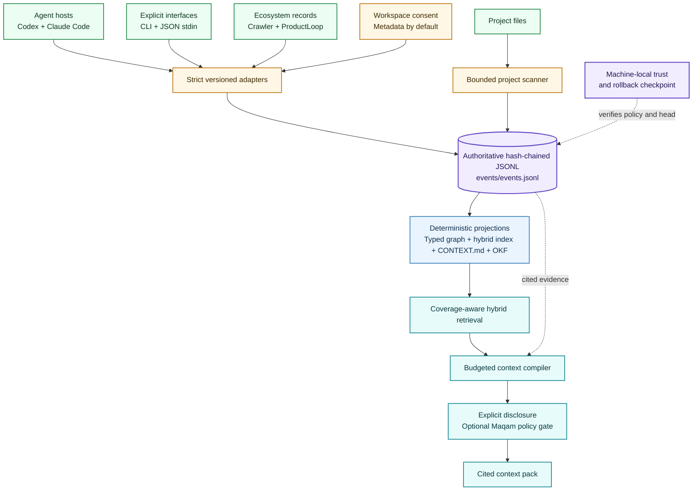
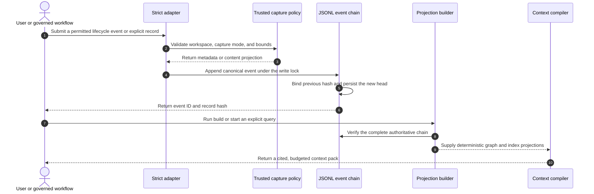

# Architecture

> One authoritative event chain. Deterministic projections. Small, cited context at task time.

Qarinah is a governance-native context compiler. It preserves permitted agent activity, explicit decisions, source evidence, and bounded project structure in a verified local record, then compiles only the context relevant to a later task.

## System map

[Open the canonical Mermaid source](architecture.mmd).

## Guarantees at a glance

| Layer | Guarantee | Boundary |
| --- | --- | --- |
| Capture | An initialized workspace and machine-local permit control whether metadata or reviewed content may be retained. | No silent global capture and no hidden-reasoning or transcript scraping. |
| Authority | Canonical JSONL events bind the previous hash, content hash, record hash, provenance, confidence, retention, and typed relations. | A valid chain proves continuity relative to the checkpoint, not the factual truth of every claim. |
| Derivation | Graph, index, Markdown, project structure, and OKF are disposable deterministic projections. | Derived state never replaces the event chain. |
| Retrieval | Hybrid retrieval applies time, retention, authority, conflict, supersession, coverage, and complete-output budgets. | Coverage describes retained evidence, not model-answer correctness. |
| Disclosure | Every selected item cites an event ID and hash. Sensitive reads may pass through Maqam. | Direct operating-system or unregistered tool activity remains outside Maqam's registered-tool boundary. |

## Write and rebuild lifecycle

An append and every security-sensitive read reload the trusted workspace from its root. Caller-supplied workspace objects are locators, not proof of trust. Explicit builds can repair stale derived views only after the event chain and machine checkpoint verify successfully. Read-only MCP diagnostics never repair or advance the checkpoint.

## Authority and machine trust

Each event identifies its workspace, optional session and turn, actor, timestamp, kind, provenance, confidence class, typed relations, previous hash, and record hash. `extracted`, `inferred`, `claimed`, and `verified` remain separate confidence classes.

A machine-local permit binds the trusted real path, workspace ID, enabled state, capture mode, event, log and context limits, retention class, verified head, and the digest of the disposable event-ID projection. A separate revocation tombstone wins over portable configuration and trust-record recreation. Policy drift, legacy trust, ledger truncation, and checkpoint rollback fail closed until explicit verified re-trust.

## Deterministic projections

| Path | Role | Authority |
| --- | --- | --- |
| `events/events.jsonl` | Canonical append-only event envelopes | Authoritative |
| `graph/graph.json` | Event nodes, typed relations, and the latest project-structure projection | Rebuildable |
| `index/index.json` | Lexical postings, trigram terms, and graph adjacency | Rebuildable |
| `records/CONTEXT.md` | Bounded human-readable current record | Rebuildable |
| `records/okf/` | Deterministic Google OKF 0.1 Draft Markdown interchange | Rebuildable |
| `index/event-ids/` | Checkpoint-authenticated idempotency buckets | Disposable and verified before use |
| `objects/` | Reserved content-addressed source snapshots | Reserved |
| `snapshots/` | Reserved signed context-pack manifests | Reserved |

The same verified event head and build inputs produce the same projections. An OKF export is portable interchange, not a second source of truth or retrieval engine.

## Retrieval lifecycle

```mermaid
flowchart LR
  query["Task query"] --> normalize["Normalize bounded terms"]
  normalize --> candidates["BM25 + trigrams + one-hop graph candidates"]
  candidates --> fusion["Reciprocal-rank fusion"]
  fusion --> policy["Time + retention + authority filters"]
  policy --> history["Conflict and supersession handling"]
  history --> diversity["Deterministic diversity"]
  diversity --> coverage{"Evidence coverage"}
  coverage -->|direct or allowed partial| budget["Complete-output budget"]
  coverage -->|below minimum| refuse["Fail closed"]
  budget --> pack["Cited JSON and Markdown pack"]

  classDef step fill:#eaf4ff,stroke:#2474b5,color:#102f4c,stroke-width:1.5px;
  classDef decision fill:#fff7e6,stroke:#b76e00,color:#3d2a00,stroke-width:1.5px;
  classDef output fill:#ecfdf3,stroke:#16803c,color:#12351f,stroke-width:1.5px;
  classDef refusal fill:#fff0f0,stroke:#b42318,color:#4c1712,stroke-width:1.5px;

  class query,normalize,candidates,fusion,policy,history,diversity step;
  class coverage decision;
  class budget,pack output;
  class refuse refusal;
```

The compiler resolves one UTC `asOf` value when the caller omits it. Exact replay supplies that value explicitly. Budgets cover the complete pretty-JSON and Markdown encodings, and every selected item records why it was chosen.

## Integration boundaries

| Integration | What enters Qarinah | Preserved boundary |
| --- | --- | --- |
| Codex | Allowlisted lifecycle schemas, skill guidance, and zero-write MCP diagnostics | Hooks provide observability, not universal host mediation. Hosted search is not hook-covered. |
| Claude Code | Allowlisted lifecycle hooks, subagent and compaction events, skill guidance, and zero-write MCP diagnostics | Transcript files are never parsed. |
| Other hosts | Explicit CLI, JSON stdin, or stdio MCP roots where supported | No universal-host compatibility claim. |
| Cockroach Crawler | Strict `SourceRecord` mapped to a stable revision and acquisition | Crawler material remains untrusted evidence and the crawler never imports Qarinah. |
| Maqam | Separately registered context query and append tools | Writes require exact approval and content consent; unregistered side effects remain outside the boundary. |
| ProductLoop | Validated, sequenced provenance events through the public sink contract | Independent run storage remains composable and divergent sequence histories are rejected. |

## Cross-platform control-plane direction

The longer-term system can place a user-space control plane above Windows, macOS, and Linux. Privileged process, filesystem, network, identity, secret, and device mediation belongs in a separate platform supervisor with its own threat model. Qarinah remains the unprivileged evidence and context layer rather than claiming operating-system authority it does not possess.
