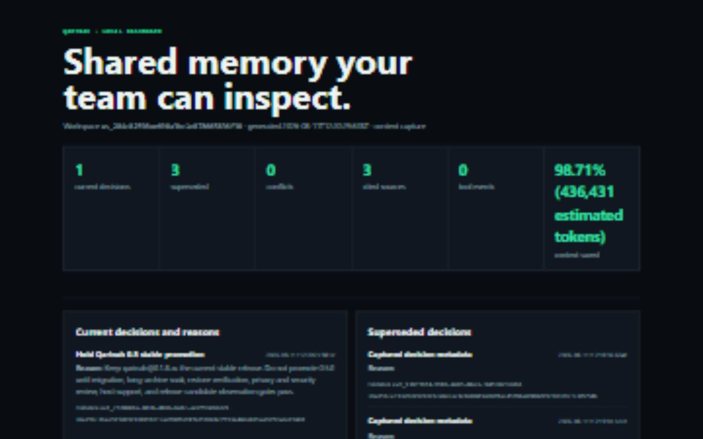

# Local memory dashboard

Qarinah's dashboard is a local, read-only view of the evidence-linked memory already retained by one initialized workspace. It helps a developer or team inspect decisions and their recorded reasons, linked tools, execution flow, major changes, conflicts, citations, affected files, and a measured context comparison without opening the raw event ledger by hand.

The dashboard is not a hosted admin service, an agent-control surface, or a second source of truth. It is a rebuildable static HTML file derived from the authoritative hash-chained JSONL ledger.



The screenshot above is a generated workspace snapshot, not fictional product UI. It shows the decision history and project structure that were actually present when the dashboard was built.

## Generate the dashboard

Run these commands from the initialized project root:

```sh
npx qarinah build
npx qarinah scan
npx qarinah dashboard
npx qarinah export okf --output .qarinah/records/qarinah-project.okf.json
```

Qarinah writes:

```text
.qarinah/dashboard/index.html
```

Open that file in a browser. It contains its own CSS and does not require a local server, hosted Qarinah account, analytics endpoint, or network connection.

The optional OKF command writes a reviewed portable bundle beside the other derived records. It does not replace the JSONL authority; use it to move an inspectable representation between compatible tools.

`qarinah scan` is optional, but the **Files and systems affected** panel remains empty until the ledger contains a project-structure snapshot.

### Choose another output path

```sh
npx qarinah dashboard --output review/qarinah-memory.html
```

The output must remain inside the initialized workspace. Parent traversal and paths outside the workspace are rejected.

### Add a measured context comparison

If a real run has a baseline estimate and the delivered Qarinah-pack estimate, supply both:

```sh
npx qarinah dashboard \
  --baseline-tokens 12000 \
  --delivered-tokens 1500
```

The dashboard calculates saved estimated tokens and the percentage difference. Both values are required together, must be non-negative integers, and must not exceed `1,000,000,000`.

These values are caller-supplied measurements. The dashboard does not read a model-provider bill, infer cached tokens, or claim that the displayed difference equals total task cost. Without both values it displays **Not measured for this workspace**.

## What every panel means

| Panel | What it shows | How it is derived |
| --- | --- | --- |
| Workspace header | Workspace ID, generation time, and active capture mode | Exact initialized workspace configuration |
| Current decisions | Decision events that have not been explicitly superseded | `decision` events without an incoming `supersedes` relation |
| Superseded decisions | Historical decisions replaced by a later recorded decision | Targets of explicit `supersedes` relations |
| Execution flow | A bounded sequence of retained prompts, tools, approvals, decisions, artifacts, summaries, completed turns, and compactions | The latest 500 permitted execution events in ledger order; hidden reasoning is excluded |
| Tools called | The latest retained tool requests and results | `tool.requested` and `tool.completed` events with session, turn, source, and evidence identity |
| Major changes | Recorded decisions, artifacts, completed-turn outcomes, and the latest codebase scan | The same reproducible data used for `.qarinah/records/CHANGES.md` |
| Conflicts requiring attention | Pairs of events recorded as contradictory | Explicit `contradicts` relations; Qarinah does not invent conflicts from wording similarity |
| Source citations | Permitted events carrying a source identifier | `provenance.sourceId`, with event ID, timestamp, and hash retained in the dashboard data |
| Agent activity timeline | The latest 100 permitted events, newest first | Validated ledger events; it is not private chat history or hidden reasoning |
| Files and systems affected | Paths, detected languages, and content hashes from the latest scan | The latest recorded project-structure snapshot |
| Context saved | Baseline, delivered, saved, and percentage estimates for one comparison | Displayed only when both CLI or API token estimates are supplied |
| Memory footprint | Retained Qarinah file bytes, compact-import source bytes when known, and the current query-pack identity and estimated size | Measured from verified local files, import receipts, and a normal bounded context compilation |

The metric strip counts current decisions, superseded decisions, explicit conflicts, distinct cited source IDs, tool events, and the optional context comparison. The complete dashboard data also includes total events, total decisions, flow steps, major changes, and affected-file count under `totals`.

The decision cards use explicit event fields. `data.reason`, `data.outcome`, and `data.alternatives` become the human explanation; tools are linked by the same session and turn or by an explicit event relation. Qarinah never fabricates a reason or exposes hidden chain-of-thought.

The footprint panel does not call storage reduction “compression.” The original archive, retained project record, and delivered model context serve different purposes. Use `qarinah footprint` for a machine-readable report and read [Measure project memory](MEMORY-FOOTPRINT.md).

## Populate a useful dashboard

### Record a cited decision

```sh
npx qarinah record \
  --kind decision \
  --title "Keep release artifacts provenance-bound" \
  --body "Publish only the reviewed artifact from the reviewed commit." \
  --confidence verified \
  --source-id "adr:release-provenance"
```

This decision appears under **Current decisions** and **Source citations**.

### Supersede an earlier decision

Copy the earlier decision's event ID from the CLI result or dashboard, then record the replacement:

```sh
npx qarinah record \
  --kind decision \
  --title "Require provenance plus registry identity" \
  --body "Verify the reviewed commit, packed artifact, registry integrity, and release record." \
  --confidence verified \
  --relation supersedes:evt_00000000-0000-4000-8000-000000000000
```

The targeted decision moves to **Superseded decisions**. Qarinah keeps it as history instead of deleting it.

### Record a conflict that needs review

```sh
npx qarinah record \
  --kind claim \
  --title "Release can bypass artifact verification" \
  --body "Conflicts with the reviewed release policy." \
  --relation contradicts:evt_00000000-0000-4000-8000-000000000000
```

The pair appears under **Conflicts requiring attention**. Only explicit relations are shown, which keeps the dashboard deterministic and reviewable.

### Refresh affected files

```sh
npx qarinah scan
npx qarinah dashboard
```

The file panel shows the latest admitted project map, not a live filesystem watcher. Run `scan` again after material project changes.

## Data flow and trust model

```text
permitted host event or explicit record
  -> validated append to .qarinah/events/events.jsonl
  -> verified ledger read
  -> deterministic dashboard view
  -> static .qarinah/dashboard/index.html
```

The ledger remains authoritative. Deleting the generated dashboard does not delete project memory; running `qarinah dashboard` rebuilds it. Editing the generated HTML does not change the ledger, decisions, graph, SQLite read model, or future context packs.

Before relying on a dashboard for review, run:

```sh
npx qarinah doctor
npx qarinah freshness
```

`doctor` verifies ledger and derived-state integrity. `freshness` separately checks cited project files for current, changed, missing, or unsafe state. The current dashboard does not replace the freshness report.

## JavaScript and TypeScript API

Build the frozen data object without writing HTML:

```js
import { buildMemoryDashboard } from "qarinah";

const dashboard = await buildMemoryDashboard({
  cwd: process.cwd(),
  baselineTokens: 12000,
  deliveredTokens: 1500
});

console.log(dashboard.totals);
console.log(dashboard.currentDecisions);
```

Write the standard static dashboard:

```js
import { writeMemoryDashboard } from "qarinah";

const result = await writeMemoryDashboard({
  cwd: process.cwd(),
  output: ".qarinah/dashboard/index.html"
});

console.log(result.output);
```

Render a previously built `QarinahMemoryDashboard` object:

```js
import { buildMemoryDashboard, renderMemoryDashboard } from "qarinah";

const data = await buildMemoryDashboard({ cwd: process.cwd() });
const html = renderMemoryDashboard(data);
```

The public schema identifier is `qarinah.memory-dashboard.v2`. TypeScript consumers can use the exported `QarinahMemoryDashboard` interface.

## Privacy and safe sharing

The generated file can contain decision titles, event IDs, timestamps, source identifiers, file paths, languages, and content hashes. Treat it as project material.

- Review the workspace capture policy before generating or sharing it.
- Do not publish the dashboard merely because it is static.
- Do not place it on an unauthenticated public host when its metadata is sensitive.
- Share a copied review artifact only with people already authorized to see the underlying project memory.
- Regenerate after ledger, policy, or project-structure changes instead of treating an old file as live state.

Qarinah's event validation and redaction boundaries still apply: credentials, browser session state, private transcripts, and hidden reasoning are outside the supported capture contract. A dashboard cannot reveal information the authoritative ledger did not retain.

## Dashboard versus other Qarinah surfaces

| Need | Use |
| --- | --- |
| Human visual review | `qarinah dashboard` |
| Small cited pack for the next agent | `qarinah query` or a task pack |
| Verify ledger and derived state | `qarinah doctor` |
| Detect changed or missing cited files | `qarinah freshness` |
| Inspect the fast local database | SQLite read-model APIs |
| Move a reviewed representation between tools | Markdown, JSON, graph, or OKF export |
| Govern which memory an agent may access | Host-owned scopes or the optional Maqam integration |

The dashboard helps a person inspect memory. It does not grant an agent access, approve an action, attach a repository scope, write an event, or dispatch a tool.

## Troubleshooting

### `WORKSPACE_NOT_INITIALIZED`

Run `npx qarinah init .` or the one-command setup from the intended project root. Qarinah will not guess a workspace.

### The file panel is empty

Run `npx qarinah scan`, then regenerate the dashboard.

### Context saved says “Not measured”

Pass both `--baseline-tokens` and `--delivered-tokens`. Qarinah deliberately does not manufacture those values.

### A known disagreement does not appear

The dashboard shows explicit `contradicts` relations only. Record the reviewed relation between exact event IDs.

### A replaced decision still appears as current

Record a later decision with `--relation supersedes:<earlier-event-id>`, then regenerate the dashboard.

### The dashboard appears stale

It is a generated snapshot. Run `qarinah doctor`, rebuild or scan if needed, and run `qarinah dashboard` again.

See [Shared team memory](TEAM-MEMORY.md), [CLI reference](CLI-REFERENCE.md), [JavaScript and TypeScript API](API-REFERENCE.md), [Security](SECURITY.md), and [Troubleshooting and recovery](TROUBLESHOOTING.md) for the surrounding workflows and boundaries.
